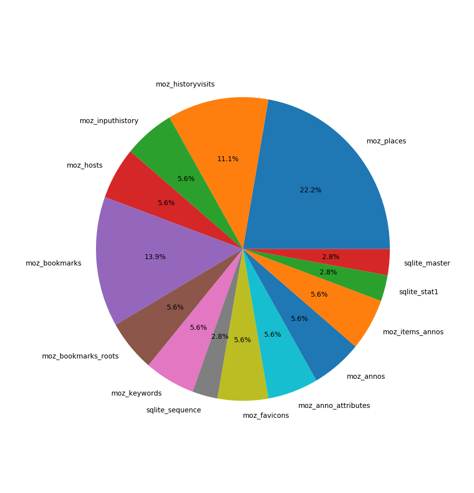

Examples
========

Human-readable header
---------------------
::

    >>> from sqliteanalyzer import SQLiteHeader
    >>> h = SQLiteHeader('test.db')
    >>> print(h)
    Header seems valid? True
    Header string: SQLite format 3
    Page size: 4096
    Format read version: 1
    Format write version: 1
    Reserved space: 0
    Max. embeded payload: 64
    Min. embeded payload: 32
    Leaf payload: 32
    Change counter: 4
    Page count: 146754
    Freelist start page: 0
    Freelist size: 0
    Schema cookie: 2
    Schema format: 4
    Page cache size: 0
    Largest b-tree-root page #: 0
    Text encoding: UTF-8
    User version: 0
    Incremental vacuum mode: False
    Application id.: 0
    Version valid for: 4
    SQLite version number: 3021000

Making a pie chart of space usage with **pyplot**
-------------------------------------------------

::

    import matplotlib.pyplot as plt
    from sqliteanalyzer import StorageAnalyzer

    path_to_db = '/home/yourusername/.mozilla/firefox/.../places.sqlite'
    a = StorageAnalyzer(path_to_db)

    tables = a.tables()
    page_usages = [a.table_page_count(table) for table in tables]

    plt.pie(page_usages, labels=tables, autopct='%1.1f%%')
    plt.show()

    Pie chart [#]_ showing the portion of storage used by each table in a
    Firefox's Places database, ``places.sqlite`` [#]_.

.. [#] https://matplotlib.org/api/_as_gen/matplotlib.pyplot.pie.html#matplotlib.pyplot.pie

.. [#] https://developer.mozilla.org/en-US/docs/Mozilla/Tech/Places/Database
